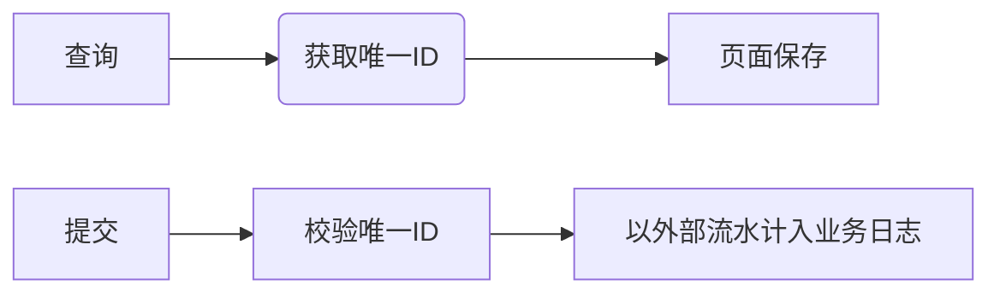
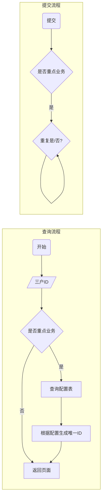

# 重点业务排重设计

## 1.配置表

```sql
-- Create table
create table PARAM.AM_REPEAT_CHECK_CONFIG
(
    PAGE_NAME   VARCHAR2(200)           not null,
    ID_KEY      VARCHAR2(50)            not null,
    EXPIRE_TIME NUMBER(8) default 60000 not null,
    OPERATOR    VARCHAR2(20),
    STATE       CHAR(1)   default 'U'   not null
)
    PCTFREE 10
    INITRANS 20
    MAXTRANS 255
    TABLESPACE TBS_PARAM_CFG_DAT_01;
comment on table PARAM.AM_REPEAT_CHECK_CONFIG is '重点业务排重配置表';
comment on column PARAM.AM_REPEAT_CHECK_CONFIG.PAGE_NAME is '页面名称';
comment on column PARAM.AM_REPEAT_CHECK_CONFIG.ID_KEY is '页面请求号码的key,如cond_ACCESS_NO';
comment on column PARAM.AM_REPEAT_CHECK_CONFIG.EXPIRE_TIME is '唯一ID失效时间,单位ms,默认一分钟';
comment on column PARAM.AM_REPEAT_CHECK_CONFIG.OPERATOR is '配置添加人';
comment on column PARAM.AM_REPEAT_CHECK_CONFIG.STATE is '状态U:启用,E:失效';
-- Create/Recreate primary, unique and foreign key constraints
alter table PARAM.AM_REPEAT_CHECK_CONFIG
    add constraint PK_AM_REPEAT_CHECK_CONFIG primary key (page_name)
        using index
            PCTFREE 10
            INITRANS 20
            MAXTRANS 255
            TABLESPACE TBS_PARAM_CFG_IND_01
            NoLogging
;
```


1. 页面查询方法通过getPageName()取到页面名称pageName

2. 通过pageName查询AM_REPEAT_CHECK_CONFIG表

3. 有配置,则保存到redis,并根据配置设置失效时间

  - key: pageName+":"+三户ID(通过配置的ID_KEY取值)
  - value: true
  - 这个值没有什么用,知识用key标识是否会重复,提交完key会删除
  - 每次请求都会重置

4. 提交

5. 根据页面的key从redis取值

6. 取到说明请求是有效的

7. 取不到说明请求无效,报错

8. 将生成的唯一流水作为外部流水传到后台

9. 后台可以再次校验

10. 提交成功,删除key

11. 失败重置失效时间






3.重点业务一定要考虑排重机制，话单处理、累账要有查重、缴费要有服务锁、赠送要记录已经送的(再次执行报错)、

缴费要判断唯一流水已经上账的不能重复上账、

短信发送要判断已经发过的不能再发、

调账已经调过的不能再处理等等；


配置表加个序列的配置(该业务的记录表主键的序列),

唯一ID就是通过配置的序列去调服务取序列值,存到redis

请求发送到后台,通过传入的唯一序列作为主业务记录的主键ID

